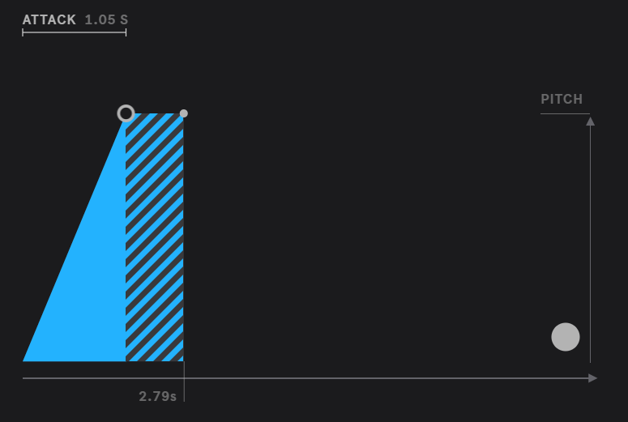

[ableton -> learn all terms with practical demo](https://learningsynths.ableton.com/en/get-started)

[Bekeleee Music -> lean basics](https://youtu.be/c3udLCvoCC0?si=mx8gIaThQ076_z3K)

[Berkelee Music Handbook](Berkelee_Music_Prodn_Handbook.pdf)

[Sound Theory Playlist](https://www.youtube.com/playlist?list=PLbhhI_j7e0uZpxHIJ9RqL5qowUUQM7kvD)

[amazing video by same above artist on sound syth :  covers in 2hrs](https://youtu.be/jWorjBDcty4?si=dQU4Kd_rXTuK0Q8L)

[Sound synthesis with wave drawings](https://youtube.com/playlist?list=PLN5UCK4omWX0VvC-5ASJ55bMWS5oUHmpi&si=8NQYBWaKEb8qh4kG)

[Simon Hutchinson Playlist](https://www.youtube.com/playlist?list=PL7w4cOVVxL6HWGokiABmiZnssYQjo_UFd)

[Quick Sound Design Basics : Part 1 ](https://youtu.be/cPxE9-Dr3EI?si=FJP_5B8YBu1aMCGU)

[Quick Sound Design Basics : Part 2 ](https://youtu.be/NJLIS2MkFe4?si=Yabp2Ei0sa9W5R-3)

## Understand synth : 

[1 : short](https://youtu.be/LJ4jN_Tmnuo?si=a0JG2zTo-YXOet5b)

[2 : longer](https://youtu.be/XmI33zP51Us?si=SI7y-vtMJxza02lx)

--------------------

## Amplitude :

- more amplitude : loud sound
- less amplitude : soft ( less ) sound
- volume up / down button on mobile : controls amplitude

--------------------

## Pitch :

- higher pitch : higher sound ( keys in right side of piano)
- lower pitch : lower sound ( keys in left side of piano ) 

### hence high pitch + high amplitude == too high sound (clash)
### hence low pitch + low amplitude == too low sound (silence)

------------

## Synthesizers::

- physical synthesizers : instruments which emit sound ( when banged / string plucked / key pressed)
- software synthesizers : computer programs which can generate sound based on a variety of parameters
- a same synth ( both software / instrument ) can sound like many differen things like ( drums / strings / sirens / alarms)
------------

## Brightness :

- higher brightness : brighter sound ( feels like a image with high contrast / sharp)
- lower brightness : dimmer sound ( feels like blurred sound )
- similar to a brightness control button on mobile : controls brightness

----------

## Movement :

- higher movement : faster sound
- lower movement : slower sound
- similar to a movement control button on mobile : controls movement

--------------------

## Envelope :

- shape of sound changing over time 
- as shape changes .. variables change as well . like pitch + amplitude 
- as `envelope changes the sound -> we also call envelope as MODULATION`
- Most synthesizers have envelopes with four sections or stages, called attack, decay, sustain, and release. 
- You'll often see these abbreviated as `ADSR`

    ## attack :
    - the shortest part, when the sound is first made
    - attack control determines how long it takes for the envelope to reach its peak at the start of a note.
    - pitch picks up and goes higher
    - 

    ## decay :
    - the part where the sound falls off
    - how long it takes for the envelope to decrease from its peak to the sustain level
    - opposite to attack
    - pitch decreases
    - 

    ## sustain :
    - the part where the sound is kept at the same volume
    - pitch remains constant
    - `if sustain == up ( its max value == pitch is highets value == no use of decay  )

    ## release :
    - the longest part, when the sound dies away
    - elease control determines how long it takes for the envelope to decrease to its minimum level after the note is released
    - pitch goes down .. min then 0

- in simple terms -> when a note is pressed 
- attack : pitch will always reach its highest value
- decay : how long it takes for the envelope to decrease from its peak to the sustain level
- sustain : the part where the note is kept at the same volume
- release : pitch will always reach its lowest value .. min then 0
- `attack -> ( deacay/sustain) -> release`
- 

- `Envelopes not only change pitch but also amplitude`

---------------

## Using envelopes as an example to our musical instruments

- [Instruments](https://learningsynths.ableton.com/en/envelopes/matching-envelopes)
- 

-----------------

## Oscialltors ( LFOs == Low frequency Oscialltors): 

- synthesizers use oscillators insted of envelopes for MODULATION 
- repeating back n forth == oscialltion
-----------

## ( LFOs == Low frequency Oscialltors): 

- LFOS mosulate modulate pitch 
- what is `LFO amount` ?
- the shape of LFO == `WAVE`
- eg : `SINE , SQUARE , SAW` waves
- emit very low freq to add disturbances in a signal
- when `LFO + pitch` == `vibrato`
- when `LFO + AMPLITUDE` == `tremolo`
- so they act as control signal. 
----------------------------

## Frequency  -> direct relation to pitch 
- inverse to time 
- low freq (low hertz) == more time to change Pitch
- high freq (high hertz) == very quick change in pitch
- hence oscilation is related to freq 
    - more freq == more oscilation ( faster ) == high pitch
    - less freq == less oscilation ( slower ) == low pitch
    - think of a car engine 
        - leg on accelerator == rpm inc == more energy ( more noise from engine)
        - leg off accelerator == rpm dec == less energy ( less noise from engine)

------------------------

## Audio Oscillators :

- produce sounds in synths ( which goes throught the above ops ... and gets modulated)
- different shapes of waves -> different timbres 

--------------------------

## study what are timbres 

## study what are pulse widths